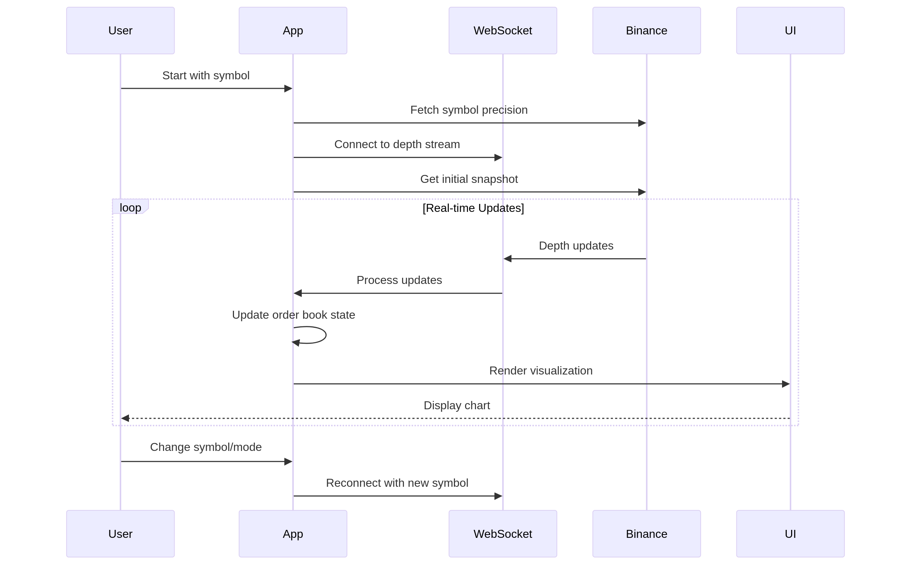

# BINANCE PERP L3 Order Book Estimator


This project is a real-time visualization tool for the Binance perpetual swap order book. The tool uses L2 data's change in time to naively estimate a L3 order book microstructure. we can change to more complex model to estimate the L3 book later.

## Diagram



## Features

- **Real-time Data**: Streams order book data using Binance's WebSocket API.
- **Bid/Ask Visualization**: Displays the current bids and asks for the binance perpetual swap.
- **Order Queue Estimation**: Estimates the order queue at each price level using L2 data.
- **Dynamic Bar Coloring**: Bid and ask bars are dynamically colored based on the age of the order.
- **K-Means Cluster**: Auto classification for different market participants

## Usage

```bash
cargo run -r
```
