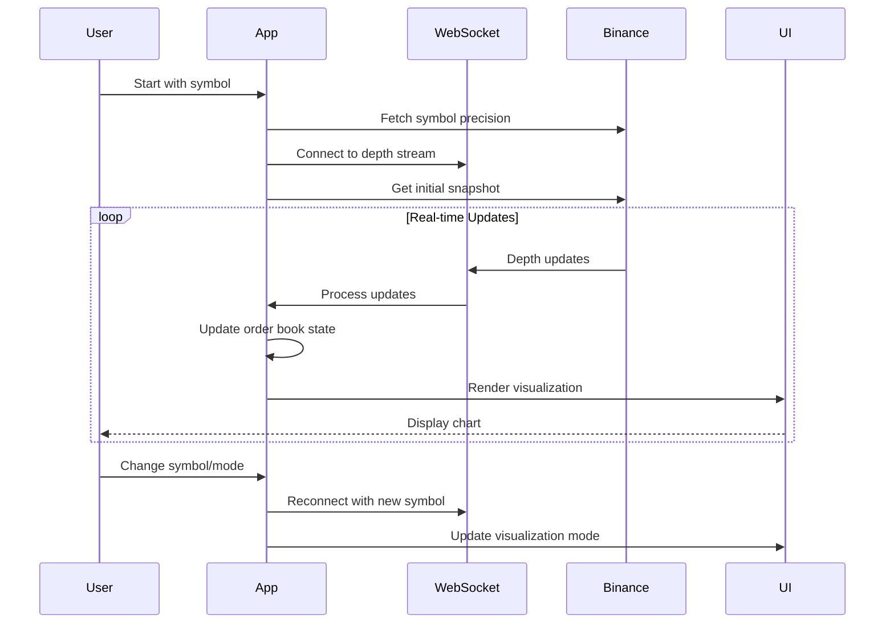

# Binance L3 Order Book Visualizer - Simplified Sequence

## Core Flow:

1. **Startup**: Parse args → Fetch precision → Connect WebSocket → Get snapshot
2. **Runtime**: Receive updates → Process order book → Render chart
3. **User Input**: Change symbol/mode → Reconnect → Update display
